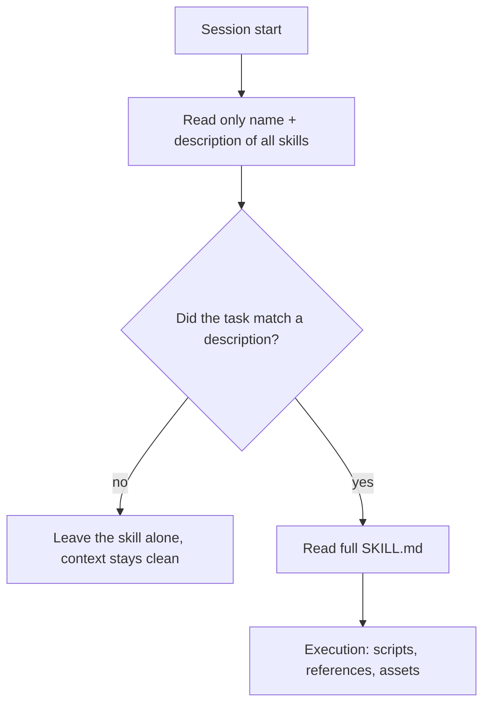
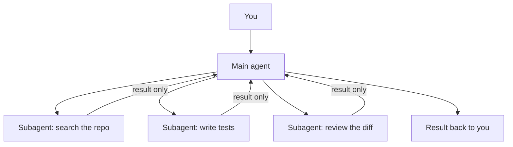

# Skills and subagents

**Source (RU):** Skills и сабагенты  
**Path:** Home → Basics of Programming with AI → Skills and subagents  
**Published:** ~4 weeks ago

## Contents

- The problem Skills solve
- What an Agent Skill is
- Progressive disclosure — how it works
- An open standard
- Skills vs MCP vs rules
- Subagents
- Skills and subagents together
- Recommendations
- Related club content

In the chapters on [Advanced context](10-advanced-context.md) and [Indexing and memory](09-indexing-and-memory.md) we learned how to feed an agent the right data. Now we talk about how to teach an agent **procedures** — repeatable skills — and how to hand work to several agents at once without drowning the context.

## The problem Skills solve

Imagine: every week you ask the agent to do the same thing — format a release by your rules, generate a migration, assemble a report from logs. Every time you explain the procedure again: which files to read, in what order to act, what format to produce.

The first thing that comes to mind is to write this into global project rules (`CLAUDE.md`, `AGENTS.md`, `.cursor/rules`). But rules have an unpleasant property: they are **always** in context. Twenty procedures in the rules means twenty procedures the agent carries into every task, even when it is writing ordinary CRUD.

**Skills** solve exactly that: the procedure lives in a separate folder, and the agent loads it only when it is needed.

## What an Agent Skill is

An **Agent Skill** is a folder with a `SKILL.md` file that holds metadata and instructions: how to do a specific task. Next to `SKILL.md` you can put scripts, templates, reference materials — everything the agent needs for the work.

```text
my-skill/
├── SKILL.md          # required: metadata + instructions
├── scripts/          # optional: executable code
├── references/       # optional: docs, handbooks
└── assets/           # optional: templates, resources
```

`SKILL.md` itself is ordinary Markdown with YAML frontmatter:

```markdown
---
name: release-notes
description: Collects release notes from merged PRs for a period. Use
  when asked to prepare a changelog, release notes, or a release description.
---

# Release notes

## Steps
1. Get the list of merged PRs via `gh pr list --state merged --base main`.
2. Group them by labels: `feat`, `fix`, `chore`.
3. Fill in the template from `assets/template.md`.
4. Do not include the `chore` section in public notes.

## Style rules
- Write in the past tense, third person.
- Each item is one line with a link to the PR.
```

Pay attention to the `description` field — it is not decoration, it is the most important line of the skill. That is what the agent uses to decide whether to pull the skill in or not. Write in it not only “what it does,” but also “when to apply it.”

## Progressive disclosure — how it works

The key mechanics of Skills is called **progressive disclosure**. A skill is loaded in three stages:

1. **Discovery.** At startup the agent reads only the `name` and `description` of each available skill. That is literally a couple of lines per skill — almost no context is spent.
2. **Activation.** When the task matches the description, the agent reads `SKILL.md` in full and takes the instructions into context.
3. **Execution.** The agent follows the instructions, running nested scripts if needed and loading files from `references/`.



Thanks to this you can have fifty skills “on hand” at a tiny context cost. That is exactly what distinguishes Skills from rules: you always pay for rules; you pay for skills **when they are used**.

## An open standard

The Agent Skills format was originally invented at Anthropic, then published as an open standard — with a spec, a site, and a repo open for contributions:

- [agentskills.io](https://agentskills.io) — format spec, quickstart, and a showcase of compatible clients
- [github.com/agentskills/agentskills](https://github.com/agentskills/agentskills) — the standard’s repository, where format evolution is discussed

And the standard was picked up very fast — today Skills are supported by, among others:

| Category | Tools |
|---|---|
| IDEs and editors | Cursor, VS Code, Kiro, Trae, Junie (JetBrains) |
| CLI agents | Claude Code, OpenAI Codex, Gemini CLI, OpenCode, Amp, Mistral Vibe |
| Platforms and frameworks | GitHub Copilot, OpenHands, Goose, Letta, Factory, Roo Code, Spring AI |

Practical takeaway: a skill written once moves between tools with almost no edits. That is a rare case of the AI tooling world agreeing on a format (the second such case is [MCP](07-model-context-protocol.md)).

## Skills vs MCP vs rules

Three ways to extend an agent are easy to mix up, so let’s put them on the shelf:

| | What it gives | When it is in context | Example |
|---|---|---|---|
| **Rules** | Standing project conventions | Always | “We use TypeScript strict, tests on Vitest” |
| **Skills** | Procedural knowledge: how to do it | On demand | “How we format a release” |
| **MCP** | Access to external systems | Tool descriptions — always | Connecting to Jira, a DB, Figma |

The simple rule: MCP gives the agent **hands**, Skills give it **instructions**, rules set the **bounds**. A skill can happily call MCP tools from inside itself — they are not competitors, they are layers.

A common beginner mistake is wrapping into a skill something the agent already does well (“how to write a unit test”). A skill is needed where there is **your** specificity: internal conventions, a non-standard workflow, knowledge that is not in the model’s training set.

## Subagents

The second way to scale an agent’s work is **subagents**. These are separate agent instances that the main agent starts for a specific subtask.

The key value here is **context isolation**. A subagent gets its own task, works in its own context window, and returns “upstairs” only the result. The main agent is not cluttered with how the subagent read forty files to find one function.



Why you need this:

- **Context savings.** “Dirty” work (search, reading logs, trying variants) stays in the subagent’s context.
- **Parallelism.** Several subagents work at the same time on independent pieces.
- **Specialization.** Each subagent can get its own role, prompt, tool set, and even its own model: the reviewer a more expensive reasoning model, the searcher a fast and cheap one.
- **Different points of view.** A great pattern is to run three subagents with different roles (security, performance engineer, architect) on the same diff and merge their findings.

Subagents are usually described the same way as skills — a Markdown file with frontmatter:

```markdown
---
name: test-writer
description: Writes and runs tests for the changed code.
tools: Read, Write, Bash
model: sonnet
---

You write tests. Cover the happy path and edge cases.
Run the tests and make sure they pass.
Return only the list of created files and the run result.
```

Subagent support currently exists in Claude Code, **Antigravity** (there they are called dynamic subagents), Cursor, Kiro, OpenCode, and a number of other agentic tools — the exact syntax differs, but the idea is the same everywhere.

Subagents are not free. Each run is separate tokens and a separate context warmup. If the task can be solved in one chat in five minutes — do not build an orchestration.

## Skills and subagents together

The most interesting part starts at the junction: a skill describes the procedure, and subagents give parallelism for executing it.

A typical scenario: a `code-audit` skill describes which axes to check the code on and in what format to return findings, and inside it instructs the main agent to launch a subagent per axis and merge the result. You write one sentence — you get a structured report from a “team.”

A good collection on this topic is the repo [Agent Skills for Context Engineering](https://github.com/muratcankoylan/Agent-Skills-for-Context-Engineering). It is an open collection of skills devoted specifically to managing context: it covers context degradation, compression, multi-agent patterns, memory systems, tool design, and long-horizon prompting. Useful both as a ready set of skills and as a textbook on what is actually worth wrapping into a skill.

## Recommendations

- **Start with one skill.** Take a task you have explained to the agent three times this month, and write it into `SKILL.md`. It gets easier from there.
- **Polish the description.** If a skill is not picked up — in 90% of cases the problem is the description, not the instructions. Add the trigger words you yourself use to phrase the task.
- **Keep `SKILL.md` short.** Anything bulky — handbooks, examples, long lists — put in `references/` and link from there. The body of the skill should be readable in a minute.
- **Deterministic work goes into scripts.** If a step can be done in code (count, convert, validate) — put a script in `scripts/` and ask the agent to run it, rather than reproduce the logic “in its head.”
- **Version in the repo.** Skills are the same kind of project artifact as a linter config. Keep them in git, review them in PRs, update them with the conventions.
- **Subagents are for wide tasks.** Audit, research, a migration across many files, comparing approaches. For a pinpoint edit they will only slow the work down.
- **Do not forget security.** A skill is instructions and executable code the agent will run without extra questions. Read a skill downloaded from the internet as carefully as someone else’s `install.sh`. Specific attack vectors are in [Security](17-security.md).

## Related club content

- 2025.12.11 / Workshop on working with Skills and Subagents in Claude Code / Ignat Rozhko
- 2026.01.13 / Call #26: UI generation (Freepik, GenSpark, Figma MCP, Storybook), Skills vs MCP, problems with Claude Code and Antigravity hangs, modern web UIs
- 2025.10.28 / Call #21: AI-browser use cases, Claude Skills, Context Management, GitHub Copilot, AI replacing us and where to grow so we are not replaced
