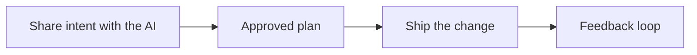
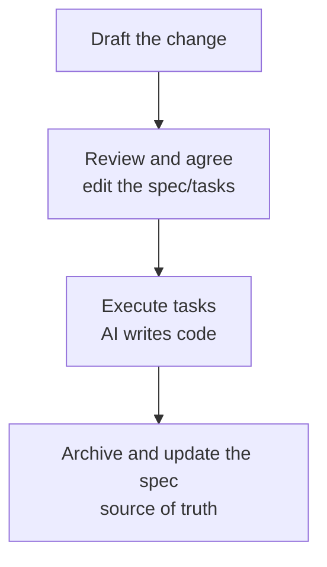

# Spec-driven development

**Source (RU):** Разработка по спецификациям  
**Path:** Home → Basics of Programming with AI → Spec-driven development  
**Published:** ~4 weeks ago

## Contents

- What specifications are
- How it works
- GitHub Spec Kit
- BMAD
- OpenSpec
- Native tools
- Example: Kiro Specs
- Spec Workflow MCP
- Conductor and context-driven development
- Related club content

Now let’s talk about how the evolution of working with `.md` led to **spec-driven development** (Spec-Driven Development, Spec Driven Development, **SDD**), and how that looks in modern agentic IDEs.

## What specifications are

For agents to work well, you first need to agree on their behavior, and only then generate code. A **specification** is a single source of truth for you and the agent: what we are building, what the bounds are, how we check. It turns “chatter” into a contract with verifiable criteria.

You already keep `TASK.md`, `CHECKLIST.md`, ADRs (Architectural Decision Records), and set style rules, conventions, and so on for agents. The next step is to write requirements as a compact `SPEC.md` or a set of spec files that the agent will read before any edits and follow while doing tasks.

**Spec-Driven Development (SDD)** is an approach to AI development where the specification becomes the main artifact, and the code is its derivative. It removes the chaos of [vibe coding](../01-basic-theory/02-user/05-vibe-coding.md) by creating a stable context for AI through executable specifications and architectural plans.

## How it works

This is still work with `.md` files and prompts, in the same family as the **Memory Bank** and **Context Pack** approaches from [Advanced context](10-advanced-context.md):

1. Something like `SPEC.md` is created; it describes the spec and links to relevant sections of project docs.
2. The agent reads `SPEC.md`, proposes a design and a plan of edits, and records a checklist.
3. From the checklist the agent writes code, tests, migrations, and at the end a report against the acceptance criteria.

These simple rules grew into whole open-source frameworks, which we talk about next.

## GitHub Spec Kit

[GitHub Spec Kit](https://github.com/github/spec-kit) is a framework that implements SDD through a linear workflow for fullstack developers, with a focus on clear stages: **spec → plan → tasks → code**.

*Image on the platform: GitHub Spec Kit — paste it here if you want it in the local notes.*

*Image on the platform: GitHub Spec Kit workflow — paste it here if you want it in the local notes.*

## BMAD

[BMAD](https://github.com/bmad-code-org/BMAD-METHOD) (**Build More, Architect Dream**) is a framework built around assembling a team of AI agents with different roles (PM, architect, developer, tester, and so on), so you can work in parallel, as in a real Agile team.

*Image on the platform: BMAD — paste it here if you want it in the local notes.*

*Image on the platform: the full BMad method workflow, showing all phases, agents, and decision points — paste it here if you want it in the local notes.*

**Spec Kit** is a better fit for individual work; **BMAD** is for complex projects with distributed specialization. Both aim to make AI-assisted coding predictable, scalable, and engineer-managed.

## OpenSpec

[OpenSpec](https://openspec.pro/) is another light and popular SDD framework that works through specifications, proposals, tasks, and deltas. It adds an `openspec/specs` and `openspec/changes` structure to the project, CLI commands, and slash commands for popular IDEs, so changes are transparent, trackable, and agreed among everyone involved.

How OpenSpec works:

1. Prepare a **proposal** for the change, in which you record the spec updates you need.
2. Review and discuss that proposal with the AI assistant until you reach agreement.
3. Implement the tasks that point at the agreed specifications.
4. Archive the change so the approved updates merge into the source specification.

## Native tools

There are also several tools that have implemented SDD at the UX level — that is, the workflow is already built into the IDE:

- **Quest Mode** in [Qoder IDE](https://qoder.com), which works analogously to Kiro Specs, but with fewer steps and more autonomy.
- **Specs** in [Kiro IDE](https://kiro.dev), described below.

## Example: Kiro Specs

**Kiro Specs** is a three-phase cycle **Requirements → Design → Implementation** built into the Kiro IDE UX. Let’s look at it on this task: you need to update the project docs, adding links to related material.

**Prerequisites:** your rules / conventions, steering docs, and other documents that matter for context already live in the repo.

### Step 0: Creating the spec

In Kiro you press **Specs → +** and briefly describe the feature. Kiro creates a spec skeleton and offers to go through three phases: Requirements, Design, Implementation.

*Image on the platform: Kiro Specs — creating the spec skeleton. Paste it here if you want it in the local notes.*

### Step 1: Requirements phase

*Image on the platform: Kiro Specs — Requirements phase. Paste it here if you want it in the local notes.*

At this step you lock in the task requirements, user stories, and acceptance criteria. Kiro auto-generates a skeleton of all of that; you only need to edit it and go to the next step in chat (there will be a button for that).

### Step 2: Design phase

*Image on the platform: Kiro Specs — Design phase. Paste it here if you want it in the local notes.*

At this step Kiro creates a design document, in which you only need to correct architecture notes and make other edits, then go to the next step in chat:

*Image on the platform: Kiro Specs — going to the next phase. Paste it here if you want it in the local notes.*

### Step 3: Implementation phase

At the implementation step Kiro turns the requirements and design into a set of tasks with a checklist. Then you just press **Start task** next to the tasks and wait until they are done.

*Image on the platform: Kiro Specs — Implementation phase. Paste it here if you want it in the local notes.*

While tasks run, Kiro automatically updates the checklist and saves results into the spec. Once all tasks are done, Kiro will offer you to do acceptance and save the results into the spec.

That is roughly what SDD looks like, but already built into the IDE.

## Spec Workflow MCP

If your tool has no built-in SDD, you can use [Spec Workflow MCP](https://github.com/Pimzino/spec-workflow-mcp), or any other MCP server that supports a Spec Workflow.

You can also always pull one of the frameworks described above into the project by hand. See [Model Context Protocol](07-model-context-protocol.md).

## Conductor and context-driven development

A separate mention goes to **Conductor** — an extension for Gemini CLI around which Google promotes the term **context-driven development**.

The idea is close to SDD, but the accent is shifted: the main problem is not that we do not write requirements, but that all the work context lives in temporary chat logs and dies with the session. Conductor moves it into standing Markdown files that sit next to the code and are committed with it.

Work is split into three steps:

1. `/conductor:setup` — once, you set project context: what the product is, for whom, on what stack, by what rules the team works.
2. `/conductor:newTrack` — for a concrete task, Specs (detailed requirements) and a Plan (a task list split by phases) are created.
3. `/conductor:implement` — the agent walks the plan, checking off what is done. You can pause the work and come back later — state lives in files, not in chat history.

A nice detail: the tool is also designed for **brownfield** projects, meaning you can start it on an existing codebase, not only a new one.

[Google’s announcement](https://developers.googleblog.com/conductor-introducing-context-driven-development-for-gemini-cli/).

In essence this is the same pattern we unpacked in [Advanced context](10-advanced-context.md) under the names Context Pack and Memory Bank — only packaged as a ready extension with a set of commands. If you like the idea but you are not on Gemini CLI, assembling an analogue by hand is entirely realistic.

## Related club content

- 2025.12.23 / Call #25: GLM-4.7, BYOK JetBrains, Context Driven Development, Code Review, wrapping up 2025
- 2025.12.11 / Workshop on working with sub-agents in Claude Code / Ignat Rozhko
- 2025.11.25 / Call #23: GPT-5.1 Codex, Gemini 3 Pro Preview, Claude Sonnet 4.5, Spec Driven Development, AI refactoring, TOON, TONL, Antigravity
- 2025.08.25 / Qoder IDE review
- 2025.08.23 / Kiro — IDE from AWS / Anton Kovalenko
