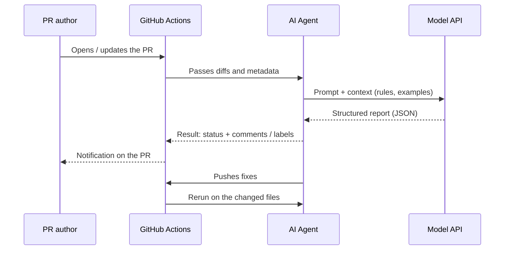

# AI Code Review

**Source (RU):** AI Code Review  
**Path:** Home → Basics of Programming with AI → AI Code Review  
**Published:** ~4 weeks ago

## Contents

- Why you need AI Code Review
- Where the agent plugs in
- How a review agent is built
- Writing your own review agent
- Example on GitHub Actions
- Ready-made solutions
- Recommendations
- Related club content

This chapter is about what AI code review is and how to set it up: from a minimal homemade agent to integration through GitHub Actions and ready-made solutions (for example, Claude Code Review Action).

## Why you need AI Code Review

AI review with agents is not a replacement for a living reviewer — it is an accelerator and a safety net:

- **Speed:** basic problems are caught automatically (dead code, N+1, unused imports, obvious bugs from the diff).
- **Shared standards:** the agent runs a checklist on style, security, performance, documentation.
- **Project context:** you can “feed” the review agent policies, conventions, examples (via [RAG](../01-basic-theory/04-master/05-rag.md) / a vector index) so it understands *your* repository.
- **Less context switching:** the PR author gets structured feedback right in pull-request comments, and sometimes code fixes as well.

## Where the agent plugs in

You have several insertion points:

- **Locally (pre-commit / pre-push):** a fast sanitary check before the push.
- **On the PR (CI/CD):** a trigger on `pull_request` / `pull_request_target` events.
- **On merge:** a final validation before the merge.
- **Periodic audit:** a nightly run over hot directories.

Interaction type:

- **Advisory (fail-open):** the agent adds comments / labels, but does not block the merge.
- **Blocking (fail-close):** the agent can fail the job if the risk is high (for example a secret or SQL injection was found).

## How a review agent is built

**Input:** the agent takes the pull-request diff, chunks of related files, manifests, linter / test logs.

**Context:** we supplement the input with data from the project style guide, MDR/ADR, security rules, “good / bad” examples (via RAG / a vector index). See [Indexing and memory](09-indexing-and-memory.md).

**Process:**

Send a prompt (input + context) → the agent analyzes the info → splits the edits by severity / categories (rubric) → proposes fixes (suggested changes / patches) → creates new commits with fixes (if you want that kind of proactivity).

**Output:** PR comments, a summary, labels, a status check (pass / warn / fail), new commits with fixes.



## Writing your own review agent

In practice you need a small script that:

- fetches the list of changed files in the pull request
- collects the diffs
- calls an LLM with a rubric prompt
- posts a comment on the pull request

### Example prompt structure (system prompt + instruction)

Integration steps:

1. Get the diff from the PR (via the GitHub API) and, if needed, trim it to token limits.
2. Mix in context: your conventions / policies (RAG is optional, but useful).
3. Call the LLM (Anthropic, OpenAI, Qwen, and so on) and get structured JSON.
4. Publish a comment on the PR and/or add labels by risk level.

This whole pipeline does not have to be written by hand — you can assemble it in a few dozen minutes with low-code tools. We will go into those in more detail in [Automation and low-code](14-automation-and-low-code.md).

## Example on GitHub Actions

Below is a working skeleton that does not depend on a specific vendor. It:

- checks out the repo
- computes the changed files
- runs your review script (`review.py`)
- publishes a comment via `github-script`

```yaml
name: ai-code-review

on:
  pull_request:
    types: [opened, synchronize, reopened]

jobs:
  review:
    permissions:
      contents: read
      pull-requests: write
    runs-on: ubuntu-latest
    steps:
      - uses: actions/checkout@v4

      - name: Get changed files
        id: changes
        uses: tj-actions/changed-files@v45

      - name: Set up Python
        uses: actions/setup-python@v5
        with:
          python-version: '3.11'

      - name: Install deps
        run: |
          python -m pip install --upgrade pip
          pip install httpx pydantic

      - name: Run AI review
        id: aireview
        env:
          GITHUB_TOKEN: ${{ secrets.GITHUB_TOKEN }}
          LLM_API_KEY: ${{ secrets.LLM_API_KEY }}
          CHANGED_FILES: ${{ steps.changes.outputs.all_changed_files }}
        run: |
          python .github/scripts/review.py \
            --pr "${{ github.event.pull_request.number }}" \
            --repo "${{ github.repository }}" \
            --files "${CHANGED_FILES}"

      - name: Post PR comment
        uses: actions/github-script@v7
        with:
          script: |
            const body = process.env.REVIEW_BODY || 'AI review finished.';
            await github.rest.issues.createComment({
              owner: context.repo.owner,
              repo: context.repo.repo,
              issue_number: context.payload.pull_request.number,
              body
            })
        env:
          REVIEW_BODY: ${{ steps.aireview.outputs.review_body }}
```

`review.py` (briefly, pseudocode):

```python
# .github/scripts/review.py
import os, json, subprocess, sys
from pathlib import Path
import httpx

LLM_ENDPOINT = os.getenv("LLM_ENDPOINT", "https://api.example.ai/v1/chat")
LLM_API_KEY = os.environ["LLM_API_KEY"]

files = sys.argv[sys.argv.index("--files")+1].split()

def git_diff(paths):
    patches = []
    for p in paths:
        diff = subprocess.check_output(["git", "diff", "origin/"+os.getenv("GITHUB_BASE_REF", "main"), "--", p]).decode()
        if diff.strip():
            patches.append(diff)
    return "\n".join(patches)

patches = git_diff(files)

prompt = {
  "system": "You are a strict code reviewer... (see the rubric)",
  "user": f"Diffs:\n```diff\n{patches}\n```"
}

headers = {"Authorization": f"Bearer {LLM_API_KEY}", "Content-Type": "application/json"}

# Depending on the vendor the format may differ — this is the general shape
payload = {"messages": [
  {"role": "system", "content": prompt["system"]},
  {"role": "user", "content": prompt["user"]}
], "max_tokens": 2000}

r = httpx.post(LLM_ENDPOINT, headers=headers, json=payload, timeout=60)
review = r.json().get("content", "")

# Output for the next Actions step (via the GITHUB_OUTPUT file)
with open(os.environ["GITHUB_OUTPUT"], "a") as f:
    f.write(f"review_body<<EOF\n{review}\nEOF\n")
```

In practice you need to plug in the real endpoint and schema (`/v1/messages` at Anthropic, `/v1/chat/completions` at OpenAI, and so on) and return JSON with the issues found, then turn it into comments on GitHub.

## Ready-made solutions

If you do not want to maintain your own script, there are quite a few ready-made solutions. Here are some popular ones:

- [Claude Code Action](https://github.com/anthropics/claude-code-action) — the official Action for running a Claude review on every PR. Usually it is enough to set `ANTHROPIC_API_KEY`, configure file filters, and the mode (advisory / blocking).
- [Gemini Code Assist](https://cloud.google.com/products/gemini/code-assist) — Google’s official AI assistant, which among other things can review pull requests on GitHub.
- [GitHub Copilot code review](https://docs.github.com/en/copilot/using-github-copilot/code-review/using-copilot-code-review) — Microsoft’s official agent that can review pull requests on GitHub; part of the GitHub Copilot agents.
- [Qodo Merge (PR-Agent)](https://www.qodo.ai/products/qodo-merge/) (formerly CodiumAI) — a GitHub App / Action that generates a review, todos, and a PR summary.

As a rule, the config of these solutions looks similar: you give access to the repository, set limits, create an Action, drop in a model key, and so on.

You can find more AI tools for code review in our club, in the Tools channel under the hashtag `#pullrequest`.

A catalog of PR and coding agents is also in [Popular tools](20-popular-tools.md#pr-and-coding-agents).

A review agent specialized in security (slash command, GitHub Action, autonomous researchers) is in [Security testing](18-security-testing.md).

## Recommendations

- **Secrets:** never log keys; for Actions use secrets and minimal permissions.
- **Context limits:** do not feed the whole codebase. Sample / compress, RAG over the needed policies, “chunk by diff.”
- **Determinism:** set `temperature≈0`, pin model versions.
- **Hallucinations:** ask it to cite specific lines / files and require `suggested_patch` as a patch. See [Hallucinations](../01-basic-theory/02-user/04-hallucinations.md).
- **Two-pass:** first a fast heuristic ranking of files, then a deep analysis of the top-N.
- **Self-check:** at the end ask the model to “self-check” the output and drop duplicates / weak findings.
- **Guardrails:** JSON schema + validation; reject the answer if it is invalid.
- **Suggested changes:** format patches as unified diff — easier for reviewers to apply.

## Related club content

- 2025.07.22 / Call #14: Comet, Kiro, Claude Code Action, Diffusion Models
