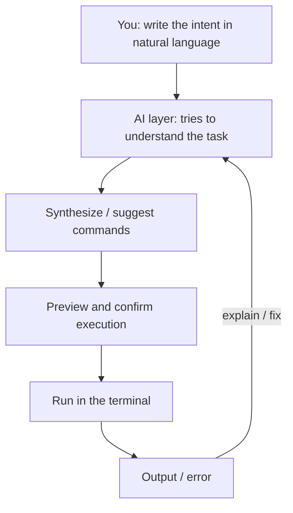

# AI in the terminal

**Source (RU):** ИИ в терминале  
**Path:** Home → Basics of Programming with AI → AI in the terminal  
**Published:** ~4 weeks ago

## Contents

- What an AI terminal is
- Why it is convenient
- Risks and how to reduce them
- Warp — the main player
- Private integrations and alternatives
- Where an AI terminal is especially useful
- Related club content

This chapter continues the themes of [chat in the IDE](05-ai-chat-in-the-ide.md), [completions](03-smart-code-suggestions.md), and [background agents](08-background-agents.md). The focus here is the command line: how AI helps you write and understand commands, speed up everyday routines, and still not step on security rakes.

## What an AI terminal is

An **AI terminal** is your ordinary command line (bash / zsh / fish / PowerShell), but with “brains” that can do the following:

- you write what you need in natural language → AI proposes a command or a set of commands to run
- you forgot how a command is spelled or how to use it — you ask AI and it explains
- you get autocomplete of commands and flags — just like with code
- the terminal learns to parse command-output logs and propose fixes
- you get auto-generation of scripts / aliases / one-liners for your context

The key idea: you describe **what** you want to do, AI proposes **how**.



## Why it is convenient

- **Speed.** You do not need to google `tar`, `ffmpeg`, `git` flags — the terminal will hint.
- **Less cognitive load.** You hand off the routine (“assemble a CSV from these JSONs”) and focus on the task.
- **Better learning.** Explanations of errors and commands are a built-in tutorial.
- **Stable pipelines.** Faster to turn one-off “spells” into repeatable scripts and workflows.
- **Teamwork.** Hints and examples can be saved, shared, and standardized.

## Risks and how to reduce them

AI in the terminal is power, but also responsibility.

**Risks**

- Leak of content to the cloud (command history, paths, repo names, logs with tokens, keys and secrets).
- Hallucinations and unsafe advice (accidental `rm -rf`, dangerous `curl | bash`, “magic” one-liners). See [Hallucinations](../01-basic-theory/02-user/04-hallucinations.md).
- Supply from external sources without verification (scripts / packages with backdoors).
- Telemetry collection and sync you may not have known about.

**Protection practices**

- Turn on **preview and confirmation** before run. Everything AI proposes, you first read with your eyes.
- Where you can, use local models or enterprise modes with DLP policies.
- Isolate execution: dev containers / Docker, separate users, min-privilege.
- Turn off / limit telemetry and sync; mask secrets in output.
- Do not send confidential data to the cloud (keys, secrets, passwords, tokens, and so on).

Add “safety-net” defaults:

```bash
# Safe defaults in bash
set -euo pipefail
alias rm='rm -i'
alias cp='cp -i'
alias mv='mv -i'
```

Ask AI to explain what the command does, and to show an equivalent with `--dry-run` if that mode exists.

More on attack vectors is in [Security](17-security.md).

## Warp — the main player

*Image on the platform: Warp — paste it here if you want it in the local notes.*

[Warp](https://www.warp.dev) is a modern agentic terminal for macOS / Linux / Windows focused on productivity and AI. It gives the widest range of capabilities for working with AI in the terminal, has an enterprise subscription, and a rich free mode.

Warp’s developers prefer not to call it a terminal, but an **Agentic Development Environment**, and there is logic in that — more and more tools for convenient work with code and even whole repositories appear in Warp (you can read about [Warp Code](https://www.warp.dev/warp-code)).

In spring 2026 Warp open-sourced its terminal client (license **AGPL-3.0**), and the paid part of the product became the cloud agent-orchestration platform **Oz** — it runs agents in isolated cloud sandboxes and is driven both from Warp itself and from any other terminal via **Oz CLI** (formerly `warp-cli`).

What is great in it:

- **Warp AI:** generating commands from a description, explaining errors, refactoring one-liners into readable scripts, a rich agent mode that can do tasks end to end.
- **Blocks:** each command and its output is a separate block. Convenient to copy, comment, share.
- **Workflows:** a catalog of parameterized prompts — turn frequent tasks into forms.
- **Warp Drive:** a set of tools for team work.
- **Warp Code:** a set of tools for convenient work with code repositories.
- Fast search over history, a command palette, panels for git and processes.

Docs: [docs.warp.dev](https://docs.warp.dev/). Oz is now also called the [Automation Platform](https://docs.warp.dev/platform/) (the `oz` CLI name remains for a while).

## Private integrations and alternatives

- **Cursor + the built-in terminal.** You can phrase the task in chat, get a command / script, and run it right in the IDE terminal. There is autocomplete for commands and flags.
- [**Copilot CLI**](https://docs.github.com/en/copilot/how-tos/use-copilot-for-common-tasks/use-copilot-in-the-cli) — a standalone terminal agent from GitHub (it replaced the `gh copilot` extension): it suggests commands, explains errors, works with issues and pull requests. Lands well if you already live in the GitHub ecosystem.
- [**ShellGPT / sgpt**](https://github.com/TheR1D/shell_gpt) — a light utility: you ask in natural language — you get a command.

You can find more on private integrations and alternatives in our club, in the Tools channel, under the hashtag `#terminal`. A fuller catalog of CLI agents is in [Popular tools](20-popular-tools.md#cli-assistants).

## Where an AI terminal is especially useful

- **DevOps / CI/CD:** generating YAML / CLI commands, migrations, kubectl / helm hints.
- **Data routine:** conversions with ffmpeg, ImageMagick, jq, csvkit.
- **Git routine:** clean aliases, auto-generating commit messages, unpacking conflicts.
- **“Support for yourself”:** read and explain someone else’s bash magic.

## Related club content

- 2025.07.08 / Call #13: Gemini CLI, Warp 2.0, Trae Agent, Claude Code vs Cursor
- 2025.06.24 / Call #12: Dia, Warp, Gemini 2.5 Flash-Lite, PDF processing
