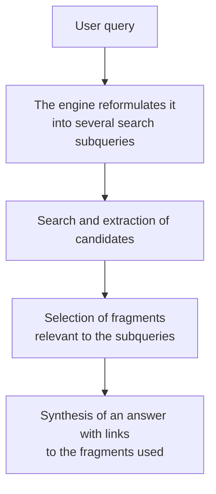

# GEO optimization

**Source (RU):** GEO-оптимизация  
**Path:** Home → Basics of Programming with AI → GEO optimization  
**Published:** ~4 weeks ago

## Contents

- What GEO is
- How GEO differs from SEO
- How AI engines pick sources
- What actually works
- Practices for a developer
- How to measure
- Recommendations

Users more and more often do not follow links — they read a ready answer in ChatGPT, Perplexity, or AI Overviews. This chapter is about how to make it so that your product, documentation, or library lands in those answers.

## What GEO is

**GEO** (Generative Engine Optimization — “optimization for generative engines”) is a set of practices that raise the probability that generative AI will mention and cite your content in an answer to the user.

The term was introduced by researchers from Princeton in a paper presented at [KDD 2024](https://dl.acm.org/doi/10.1145/3637528.3671900) — the first benchmark for measuring that kind of visibility appeared there as well. In a couple of years the topic went from academic curiosity to a separate industry with tools, job openings, and budgets.

Paper: [GEO: Generative Engine Optimization](https://arxiv.org/abs/2311.09735) (Aggarwal et al.).

The reason is simple: the familiar funnel broke. Before, a person entered a query, got ten blue links, and clicked somewhere. Now they get a ready answer, and links are an optional appendix to it. If you are not inside the answer, you are not there at all — whatever your place in organic search.

## How GEO differs from SEO

Do not think that GEO is “SEO with a new name.” The object of optimization itself is different.

| SEO | GEO |
|---|---|
| **Goal** | Position in a list of links | Mention and citation in the answer |
| **Unit** | Page | A fragment of text that is convenient to cite |
| **Who “reads”** | Crawler + ranking algorithm | An LLM that retells in its own words |
| **Metric** | Position, CTR, traffic | Share of answers with a mention, tone, context |
| **Queries** | Short keywords | Long conversational phrasings |

The main difference: the model does not rank, it **retells**. It needs not a “keyword-optimized” text, but a fragment that is easy to pull out of context, understand, and insert into an answer without mangling it. From that the priorities change: instead of keyword density — self-contained paragraphs; instead of link mass — factual verifiability.

GEO does not cancel SEO: generative engines still pull sources from the search index. If you are not in the index — there is nothing to cite.

## How AI engines pick sources

Simplified, the path of a query looks like this:

From that scheme come two non-obvious conclusions:

**You optimize not a page, but a fragment.** What lands in the answer is not “your article,” but two specific paragraphs. So those paragraphs must be understandable without the rest of the text.

**One user query is several engine queries.** The model splits the question into subquestions. A page that honestly answers one narrow subquestion is often cited more often than a big overview longread.

Related Basic Theory: this retrieval-and-synthesis shape is close to [RAG](../01-basic-theory/04-master/05-rag.md).

## What actually works

The Princeton study ran about 10,000 queries through nine content-modification strategies. The results are worth knowing, because some of them are counterintuitive:

- **Adding statistics and numbers** — the strongest effect, up to **+41%** to visibility. Models are noticeably more willing to cite fragments with concrete numbers than general reasoning.
- **Citing sources.** Text that itself links to research and primary sources is treated as more authoritative — the effect is stable across topics.
- **Direct quotes from experts** work in the same direction.
- **Clear language and an authoritative tone** give a moderate but steady lift.
- **Keyword stuffing** — that same SEO classic — practically gives no effect. The model does not count occurrences; it understands meaning.

In total, competent optimization gave a visibility lift in the range of **22–41%** depending on the topic.

💡 The same technique gives a different effect in different niches: in technical topics numbers and sources play strongest; in consumer topics — quotes and plain language.

## Practices for a developer

Now the concrete part — what to do if you make a product, a library, or documentation.

### Content structure

- **Answer the question in the first paragraph.** Definition, answer, conclusion — at the top. Justification — below. The model will most likely take exactly that first self-contained chunk.
- **Phrase headings as questions.** “How do I configure webhooks?” is cited better than “Webhooks.”
- **Write self-contained paragraphs.** No “as we said above” and no “in this case” without naming the case. A paragraph should read in isolation from the page.
- **Use lists and tables.** Structured fragments are easier to extract and retell without distortion.
- **Add an FAQ section.** A few “question — short answer” blocks cover exactly the subqueries the engine splits the user’s original question into.

### Technical part

- **`llms.txt`** — a file at the root of the site that describes its structure in a “prompt-friendly” form: what the project is, where the key sections are, where the documentation is. The format is not yet a generally accepted standard, but the cost of it is minimal, and more and more documentation sites publish it. Spec: [llmstxt.org](https://llmstxt.org/).
- **Schema.org markup** (`Article`, `FAQPage`, `HowTo`, `SoftwareApplication`) — helps the engine understand the type and structure of the content. See [schema.org](https://schema.org/).
- **Content available without JS.** If the text renders only on the client, some crawlers simply will not see it. For documentation that is critical.
- **`robots.txt` and AI crawlers.** Check that you are not blocking GPTBot, ClaudeBot, PerplexityBot, and company. This is a conscious choice: close yourself off — and you drop out of answers; open yourself — and you give the content for training and citation. OpenAI: [GPTBot](https://platform.openai.com/docs/bots). Anthropic: [ClaudeBot](https://support.anthropic.com/en/articles/8896518-does-anthropic-crawl-data-from-the-web-and-how-can-site-owners-block-the-crawler). Perplexity: [crawlers](https://docs.perplexity.ai/guides/bots).

### Content

- **Concrete numbers instead of judgments.** “Handles 50,000 requests per second on a single instance” instead of “high performance.”
- **Dates and versions.** Explicitly say which version the instruction applies to and when it was updated — freshness affects source selection.
- **Link to primary sources.** Not only for the reader, but as a signal of reliability.
- **Presence outside your own site.** Models actively pull from GitHub, Stack Overflow, Reddit, Hacker News, and specialist venues. A good README and a living issue tracker sometimes give more visibility than a landing page.

## How to measure

GEO does not have its own “Search Console,” so measurement is a separate task. Three approaches work:

- **By hand.** Make a list of 20–30 questions on which you should be found, and once a month run them through ChatGPT, Claude, Perplexity, and Google AI Overviews. Record: whether they mentioned you, in what context, whom they mentioned instead of you.
- **With your own script.** The same list, but through the APIs of several models with results saved. A few hours of work, but full control and history.
- **Ready-made platforms.** A whole class of AI-visibility monitoring services has appeared — they track brand mentions in answers of different engines, tone, and how you are described relative to competitors. The most visible player on the market is [Profound](https://www.tryprofound.com), but there are already dozens of alternatives, and the category is growing fast.

Key metrics worth watching: share of answers with a mention, tone of the mention, and **correctness** — the model can cite you but mix up the facts, and that is a separate problem.

## Recommendations

- **Do not drop SEO.** GEO works on top of it: no indexing — no citation.
- **Start with documentation.** For a technical product that is the main source of quotes — structure, questions, and concreteness are already there.
- **Saturate the text with facts.** Numbers, versions, benchmarks, dates — the cheapest and most effective technique.
- **Check that you are visible at all.** Ask three engines the thing you should be found for. The result is often sobering.
- **Watch `robots.txt`.** Many people block AI crawlers out of inertia, and then wonder why they are not in the answers.
- **Do not get carried away with gaming it.** Attempts to manipulate AI results through injections in the text and generated “content farms” get caught the same way keyword stuffing once did — and the blowback already lands today.
